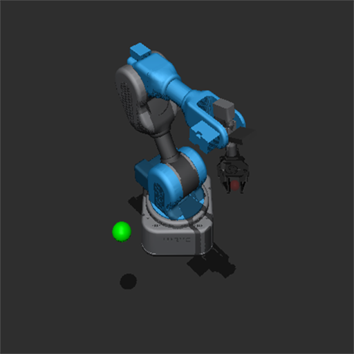
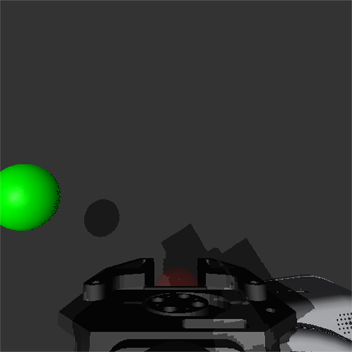

# Niryo Gymnasium Environment

This is a simple reinforcement learning mujoco gym-environment for the [Niryo-NED2](https://niryo.com/product/educational-desktop-robotic-arm/) robot arm. The basis is heavily insprired by the Farama foundation's [gymnasium-robotics](https://robotics.farama.org/) (the Fetch evironments in particular). The original URDF files and meshes of the Niryo robot(s) that are included here are taken from the [official Niryo repository](https://github.com/NiryoRobotics/ned_ros).

The repository is intended to be as stand-alone as possible, depending only on `gymnasium`, `mujoco` and `numpy` (developed with python `3.12.8`). 

## Environments

We include the following environments as gymnasium-registered strings:

| Base Environments     | Task    | 
| :---------------------| :------ |
| `NiryoReach-v1`       |   Move end-effector (gripper) to random target site.   |
| `NiryoLift-v1`        |   Grasp randomly placed object cube with end-effector (gripper) and lift to target site (always `+0.5` in the z-axis from wherever the object position is).   |
| `NiryoPickAndPlace-v1`|  Grasp randomly placed object cube with end-effector (gripper) and move to random target site.   |

The control frequency of the robot is of `f = 25 Hz`. This is achieved by applying the same action in 20 subsequent simulator step (with a time step of `dt = 0.002 s`) before returning the control to the robot.

### Modifications

All base-environments are registered with the following default parameters:    
```python
        default_kwargs = {
            "reward_type":"sparse",    # one of ['sparse', 'dense']
            "observation_type":"goal"  # one of ['goal', 'camera']
            "width":512, "height":512  # rendering resolution (px)
        }
        max_episode_length = 50
```
    
You can change these setting in the `gym.make` call, e.g.; 
```python
    env = gym.make(
        'NiryoReach-v1', 
        max_episode_steps=100, 
        reward_type="dense", 
        observation_type="camera",
        width=128, height=128
    )
```

### Action and Observation Spaces
Depending on the `control_type`(wip) and `observation_type` the environments changes respectively to:

| `control_type` | `observation_type` | observation | action |
|:--------------:|--------------------|-------------|-------|
|  `mocap`       | `goal` | `dict(`<br>`desired_goal=Box(3,),`<br>`achieved_goal=Box(3,),`<br>`observation=Box(10,)`<br>`)`| `Box(-1.0, 1.0, (4,))`|
|  `mocap`       | `camera` | `dict(`<br>`camera_pov=Box(width,height,3),`<br>`camera_front=Box(width,height,3),`<br>`observation=Box(10,)`<br>`)`| `Box(-1.0, 1.0, (4,))`|
|  `free` (wip)      | `goal` | `dict(`<br>`desired_goal=Box(3,),`<br>`achieved_goal=Box(3,),`<br>`observation=Box(10,)`<br>`)`| `Box(-1.0, 1.0, (7,))`|
|  `free` (wip)      | `camera` | `dict(`<br>`camera_pov=Box(width,height,3),`<br>`camera_front=Box(width,height,3),`<br>`observation=Box(10,)`<br>`)`| `Box(-1.0, 1.0, (7,))`|

where 
- `observation_type='goal'` is the goal-aware farama-robotics fetch robot dict-observation space (e.g. for Hindsight Experience Replay),
- `observation_type='camera'` is a dict-observation space with the robot's vector observation, as well as the frontal and gripper-pov camera-render image,
-  `control_type='mocap'` is the farama-robotics Cartesian displacement dx, dy, and dz of the end effector, plus the control for closing and opening of the gripper, and
-  `control_type='free'` is the full DOF control of all 6 controllable joints, plus the control for closing and opening of the gripper. (In the order of shoulder, arm, elbow, forarm, wrist, hand, gripper.)

Depending on the `height, width` resolution of your renderer (here `512x512`), the camera observations look like this:

|`camera_front`| `camera_pov`|
|-|-|
|||


## Installation

1. Setup
    ```sh
        git clone https://github.com/m-zorn/niryo-gym.git
        cd niryo-gym
        conda create -n niryo_gym python=3.12.8
        conda activate niryo_gym
        (niryo_gym) pip install -r requirements.txt
    ```

2. Testing  
    ```sh
        # if you want to run a benchmark-tests, also install
        (niryo_gym) pip install stable-baselines3
    ```
    Then you can simply run the following (cf. `test_ppo.py`):
    ```python
    import gymnasium as gym
    from stable_baselines3 import PPO
    import niryo_gym

    if __name__=="__main__":
        # Initialize env and model
        env = gym.make("NiryoReach-v1")
        model = PPO(
            "MultiInputPolicy",
            env,
            verbose=1,
        )

        # Train the model
        model.learn(50000)

        # Visualize trained policy
        env = gym.make("NiryoReach-v1", render_mode="human")
        obs, _ = env.reset()
        while True:
            action, _states = model.predict(obs)
            obs, rewards, trunc, term, info = env.step(action)
            if trunc or term:
                obs, _ = env.reset()
    ```